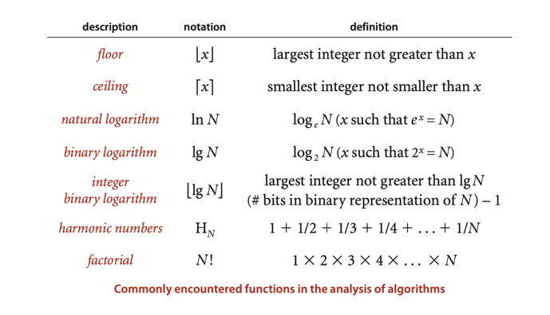
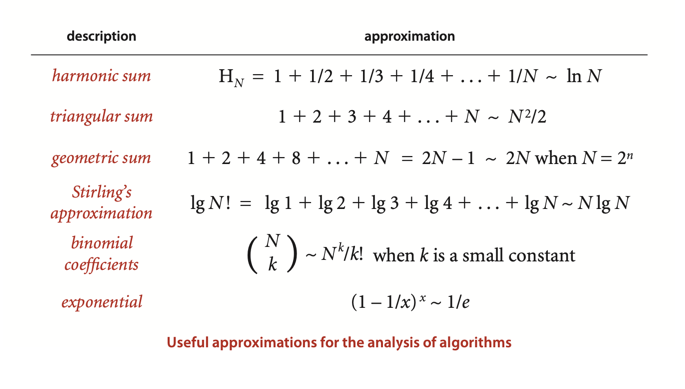
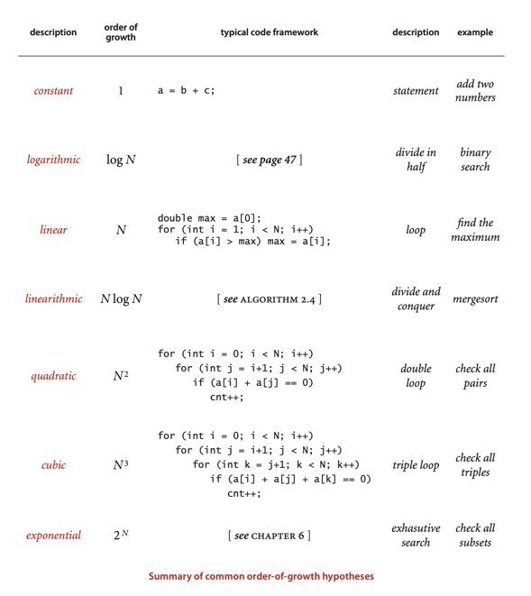
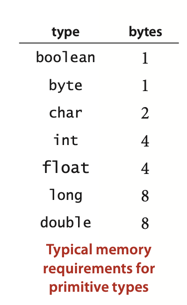
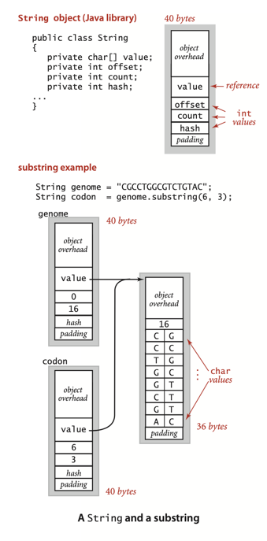

# Analysis of Algorithms

## Power-Law:

T(N) = a * N^b  
where T - time, N - problem size (amount of items).

Knuth’s basic insight is simple: the total running time of a program is determined by two primary factors:

- The cost of executing each statement
- The frequency of execution of each statement

_The number of combinations of n objects taken r at a time is determined by the following formula:
C(n,r) = n! / ((n−r)! r!)_

Example: C(n, 3) = n * (n - 1) * (n - 2) / 6

## Tilde approximations.

Tilde approximation:  
n * (n - 1) * (n - 2) ~ __n^3 / 6__

Order of growth:  
__n^3__

g(N) ~ a * f(N) where f(N) = N^b(log N)^c  
**g(N) ~ a * N^b * (log N)^c**

f(N) is O(g(N)) (Big Oh)

**"big-Omega"** notation is typically used to describe a lower bound on the worst case.  
**"big-Theta"** notation is typically used to describe the performance of algorithms that are optimal in the sense that
no algorithm can have better asymptotic worst-case order of growth.

***

- _PropertyA._ The order of growth of the running time of ThreeSum(to compute the number of triples that sum to 0 among
  N numbers) is N^3.
- _Evidence:_ Let T(N) be the running time of ThreeSum for N numbers.
  The mathematical model just described suggests that T(N) ~ a * N^3 for some machine dependent constant a;
  experiments on many computers (including yours and ours) validate that approximation.

---

## Cost Model

- PropositionB. The brute-force 3-sum algorithm uses ~ N^3/2 array accesses to compute the number of
  triples that sum to 0 among N numbers.
- Proof: The algorithm accesses each of the 3 numbers for each of the ~N^3/6 triples.

___

## Summary.

For many programs, developing a mathematical model of running time reduces to the following steps:

- Develop an input model, including a definition of the problem size.
- Identify the inner loop.
- Define a cost model that includes operations in the inner loop.
- Determine the frequency of execution of those operations for the given input.

Example:  
__Binary search__. The **input model** is the array a[] of size N; the **inner loop** is the statements in the single
while loop;
the **cost model** is the compare operation (compare the values of two array entries); and the analysis, discussed in
Section 1.1 and given in full detail in Proposition B in Section 3.1, shows that the number of compares is at
most lg(N) + 1.

## Doubling Ratio

***

- _Proposition C_. (Doubling ratio)   
  If T(N) ~ a*N^b*lg(N) then T(2N)/T(N) ~ 2b
- _Proof_: Immediate from the following calculation:
  T(2N)/T(N) = a*(2N)^b*lg(2N)/a*N^b*lgN =2^b*(1+lg2/lgN)
  ~ 2b

---

## Worst case performance guarantees

***

- _PropositionD_. In the linked-list implementations of Bag(Algorithm1.4), Stack (Algorithm 1.2),
  and Queue (Algorithm 1.3), all operations take constant time in the worst case.
- _Proof_: Immediate from the code. The number of instructions executed for each operation is bounded by a small
  constant.
  Caveat : This argument depends upon the (reasonable) assumption that the Java system creates a new Node in constant
  time.

___

## Amortized analysis

Accordingly, another way to provide a performance guarantee is to amortize the cost, by keeping track of the total cost
of all operations, divided by the number of operations.

## Memory

For example, if you have **1GB** of memory on your computer (1 billion bytes),
you cannot fit more than about **32 million int values** or
**16 million double values** in memory at any one time.

Objects:
For example, an Integer object uses 24 bytes (
16 bytes of overhead (reference to the object’s class, garbage collection information, and synchronization information),
4 bytes for its int instance variable,
and 4 bytes of padding (Moreover, the memory usage is typically padded to be a multiple of 8 bytes (machine words, on a
64-bit machine)))

### Strings and substrings

When you use the substring() method, you create a new String object (40 bytes) but reuse the same value[] array, so a
substring of an existing string takes just 40 bytes. The character array containing the original string is aliased in
the object for the substring; the offset and length fields identify the substring. In other words, a **substring takes
constant extra memory** and forming a **substring takes constant time**, even when the lengths of the string and the
substring are huge.

# Exercise:

## Done:

1.4.2 Modify ThreeSum to work properly even when the int values are so large that adding two of them might cause
overflow.  
[Implementation: ThreeSumWithoutOverflow.java](./exercises/ThreeSumWithoutOverflow.java)

1.4.10 Modify binary search so that it always returns the element with the smallest index
that matches the search element (and still guarantees logarithmic running time).  
[Implementation: BinarySearch.java](./exercises/BinarySearch.java)

1.4.14 4-sum. Develop an algorithm for the 4-sum problem.
[Implementation: FourSum.java](./creative/FourSum.java)

1.4.11 Add an instance method howMany() to StaticSETofInts (page 99) that finds the number of occurrences of a given key
in time proportional to log N in the worst case.  
[Implementation: StaticSETofInts.java](./exercises/StaticSETofInts.java)

1.4.12 Write a program that, given two sorted arrays of N int values, prints all elements that appear in both arrays, in
sorted order. The running time of your program should be proportional to N in the worst case.  
[Implementation: DuplicateElementsInArrays.java](./creative/DuplicateElementsInArrays.java)

1.4.15 Faster 3-sum. As a warmup, develop an implementation TwoSumFaster that uses a linear algorithm to count the pairs
that sum to zero after the array is sorted(instead of the binary-search-based linearithmic algorithm). Then apply a
similar idea to develop a quadratic algorithm for the 3-sum problem.  
[Implementation: ThreeSumFaster.java](./creative/ThreeSumFaster.java)  
[Implementation: TwoSumFaster.java](./creative/TwoSumFaster.java)

1.4.16 Closest pair (in one dimension). Write a program that, given an array a[] of N
double values, finds a closest pair : two values whose difference is no greater than the difference of any other pair
(in absolute value). The running time of your program should be linearithmic in the worst case.  
[Implementation: ClosestAndFarthestElems.java](./creative/ClosestAndFarthestElems.java)

1.4.17 Farthest pair (in one dimension). Write a program that, given an array a[] of N
double values, finds a farthest pair : two values whose difference is no smaller than the
difference of any other pair (in absolute value). The running time of your program should be linear in the worst case.  
[Implementation: ClosestAndFarthestElems.java](./creative/ClosestAndFarthestElems.java)

1.4.18 Local minimum of an array. Write a program that, given an array a[] of N distinct
integers, finds a local minimum: an index i such that a[i-1] < a[i] < a[i+1].
Your program should use ~2lg N compares in the worst case.
Answer : Examine the middle value a[N/2] and its two neighbors a[N/2 - 1] and
a[N/2 + 1] . If a[N/2] is a local minimum, stop; otherwise search in the half with the
smaller neighbor.  
[Implementation: LocalMinimum.java](./creative/LocalMinimum.java)

1.4.19 Local minimum of a matrix. Given an N-by-N array a[] of N 2 distinct integers, design an algorithm that runs in
time proportional to N to find a local minimum: a pair of indices i and j such that a[i][j] < a[i+1][j], a[i][j] <
a[i][j+1], a[i][j] < a[i-1][j], and a[i][j] < a[i][j-1]. The running time of your program should be proportional to N in
the worst case.  
[Implementation: LocalMinimum.java](./creative/LocalMinimum.java)

1.4.20 Bitonic search. An array is bitonic if it is comprised of an increasing sequence
of integers followed immediately by a decreasing sequence of integers. Write a program
that, given a bitonic array of N distinct int values, determines whether a given integer
is in the array. Your program should use ~3lg N compares in the worst case.  
[Implementation: BitonicSearch.java](./creative/BitonicSearch.java)

1.4.22 Binary search with only addition and subtraction. [Mihai Patrascu] Write a
program that, given an array of N distinct int values in ascending order, determines
whether a given integer is in the array. You may use only additions and subtractions
and a constant amount of extra memory. The running time of your program should be
proportional to log N in the worst case.

Answer : Instead of searching based on powers of two (binary search), use Fibonacci
numbers (which also grow exponentially). Maintain the current search range to be the
interval [i, i + F k ] and keep F k and F k–1 in two variables. At each step compute F k–2 via
subtraction, check element i + F k–2 , and update the current range to either [i, i + F k–2 ]
or [i + F k–2 , i + F k–2 + F k–1 ].  
[Implementation: BinarySearchFibonacci.java](./creative/BinarySearchFibonacci.java)

1.4.24 Throwing eggs from a building. Suppose that you have an N-story building and
plenty of eggs. Suppose also that an egg is broken if it is thrown off floor F or higher,
and unhurt otherwise. First, devise a strategy to determine the value of F such that the
number of broken eggs is ~lg N when using ~lg N throws, then find a way to reduce the
cost to ~2lg F.  
[Implementation: ThrowingEggs.java](./creative/ThrowingEggs.java)

1.4.25 Throwing two eggs from a building. Consider the previous question, but now
suppose you only have two eggs, and your cost model is the number of throws. Devise
a strategy to determine F such that the number of throws is at most 2√N, then find a
way to reduce the cost to ~c √F. This is analogous to a situation where search hits (egg
intact) are much cheaper than misses (egg broken).
[Implementation: ThrowingTwoEggs.java](./creative/ThrowingTwoEggs.java)

1.4.34 Hot or cold. Your goal is to guess a secret integer between 1 and N. You repeatedly
guess integers between 1 and N. After each guess you learn if your guess equals the
secret integer (and the game stops). Otherwise, you learn if the guess is hotter (closer to)
or colder (farther from) the secret number than your previous guess.
Design an algorithm that finds the secret number in at most ~2 lg N guesse  
[Implementation: HotOrCold.java](./creative/HotOrCold.java)

## Not covered/ TODO (numbers)

- 1.4.23
- 1.4.26 (3-collinearity)
- 1.4.27 (Queue with two stacks)
- 1.4.28 (Stack with a queue)
- 1.4.29 (Steque with two stacks)
- 1.4.30 (Deque with a stack and a steque)
- 1.4.31 (Deque with three stacks)
- 