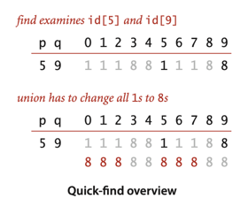
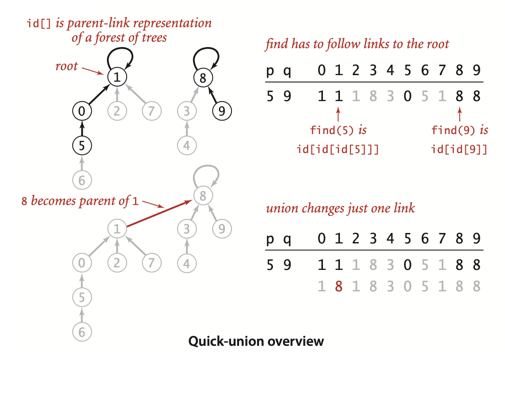
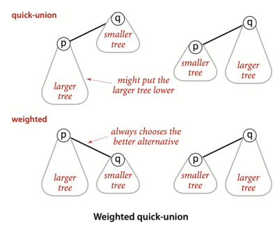

# Union Find

## Implementations

### Quick-find

Complexity of find is O(1)  
Complexity of union N elements is O(N^2)

_One approach is to maintain the invariant that p and q are connected if and only if id[p] is equal to id[q]_



```
public int find(int p) {  return id[p];  }

public void union(int p, int q) {
     int pID = find(p);
     int qID = find(q);

     if (pID == qID) return;

     // Rename p’s component to q’s name.
     for (int i = 0; i < id.length; i++)
         if (id[i] == pID) id[i] = qID;
     
     count--; 
}
```

### Quick-union

Complexity of find is O(N) in worst case  
Complexity of union N elements is O(N^2) in worst case



```
private int find(int p) { 
     while (p != id[p]) p = id[p];
     return p; 
}

public void union(int p, int q) {
     int pRoot = find(p);
     int qRoot = find(q);
     if (pRoot == qRoot) return;
     id[pRoot] = qRoot;
     count--; 
}
```

### Weighted quick-union.

Complexity of find is O(log N) in worst case  
Complexity of union N elements is O(log N) in worst case

_Rather than arbitrarily connecting the second tree to the first for union(), we keep track
of the size of each tree and always connect the smaller tree to the larger._



# Exercise:

## Done:

1.5.11 Implement weighted quick-find, where you always change the id[] entries of the smaller component to the
identifier of the larger component. How does this change affect performance?
[Implementation: WeightedQuickUnionWithPathCompression.java](./creative/WeightedQuickUnionWithPathCompression.java)

1.5.12 Quick-union with path compression. Modify quick-union (page 224) to include path compression, by adding a loop to
union() that links every site on the paths from p and q to the roots of their trees to the root of the new tree. Give a
sequence of input pairs that causes this method to produce a path of length 4. Note : The amortized cost per operation
for this algorithm is known to be logarithmic.
[Implementation: UFQuickUnion.java](./UFQuickUnion.java)

1.5.13 Weighted quick-union with path compression. Modify weighted quick-union (Algorithm 1.5) to implement path
compression, as described in Exercise 1.5.12. Give a sequence of input pairs that causes this method to produce a tree
of height 4. Note : The amortized cost per operation for this algorithm is known to be bounded by a function known as
the inverse Ackermann function and is less than 5 for any conceivable practical value of N.
[Implementation: WeightedQuickUnionWithPathCompression.java](./creative/WeightedQuickUnionWithPathCompression.java)

1.5.14 Weighted quick-union by height. Develop a UF implementation that uses the same basic strategy as weighted
quick-union but keeps track of tree height and always links the shorter tree to the taller one. Prove a logarithmic
upper bound on the height of the trees for N sites with your algorithm.
[Implementation: WeightedQuickUnionByHeight.java](./creative/WeightedQuickUnionByHeight.java)

1.5.17 Random connections.
Develop a UF client ErdosRenyi that takes an integer value N from the command line,
generates random pairs of integers between 0 and N-1, calling connected() to determine
if they are connected and then union() if not (as in our development client),
looping until all sites are connected, and printing the number of connections generated.
Package your program as a static method count() that takes N as argument and returns the number
of connections and a main() that takes N from the command line, calls count(), and prints the returned value.
[Implementation: RandomConnections.java](./creative/RandomConnections.java)

1.5.20 Dynamic growth. Using linked lists or a resizing array, develop a weighted quick-union implementation that
removes the restriction on needing the number of objects ahead of time. Add a method newSite() to the API, which returns
an int identifier.
[Implementation: WQUDynamicGrowth.java](./creative/WQUDynamicGrowth.java)

1.5.21 Erdös-Renyi model. Use your client from Exercise 1.5.17
to test the hypothesis that the number of pairs generated to get one component is ~ 1⁄2N ln N.
[Implementation: ErdosRenyiModel.java](./experiments/ErdosRenyiModel.java)

## Not covered/ TODO (numbers)

- 1.5.15 Binomial trees.
- 1.5.16 Amortized costs plots.
- 1.5.18 Random grid generator.
- 1.5.22 Doubling test for Erdös-Renyi model.
- 1.5.23 Compare quick-find with quick-union for Erdös-Renyi model.
- 1.5.24 Fast algorithms for Erdös-Renyi model.
- 1.5.25 Doubling test for random grids
- 1.5.26 Amortized plot for Erdös-Renyi. 