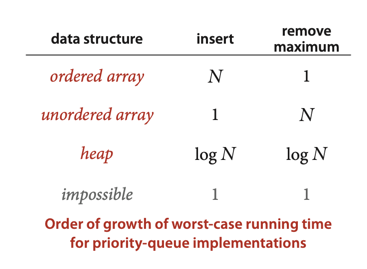
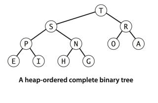
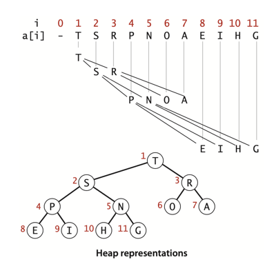

# Priority Queues

## Implementations characteristics:

## Binary Heap

**Definition**. A binary tree is heap-ordered if the key in each node is larger than or
equal to the keys in that node’s two children (if any).

___
**Proposition O**. The largest key in a heap-ordered binary tree is found at the root.

**Proof**: By induction on the size of the tree.
***

**Definition**. A binary heap is a collection of keys arranged in a complete heap-ordered
binary tree, represented in level order in an array (not using the first entry).

___
**Proposition P**. The height of a complete binary tree of size N is ⎣lg(N)⎦ .

**Proof**: The stated result is easy to prove by induction or by noting that the height
increases by 1 when N is a power of 2.
***

**Proposition Q**. In an N-key priority queue, the heap algorithms require no more than
1 + lg N compares for insert and no more than 2lg N compares for remove the maximum.

**Proof**: By Proposition P, both operations involve moving along a path between the root
and the bottom of the heap whose number of links is no more than lg N.
The _remove the maximum operation requires two compares for each node on the path_ (except
at the bottom): one to find the child with the larger key, the other to decide whether
that child needs to be promoted.
___

## Heapsort

Heapsort breaks into two phases: **heap construction**, where we reorganize the original array
into a heap, and the **sortdown**, where we pull the items out of the heap in decreasing order
to build the sorted result.

___
**Proposition S**. Heapsort uses fewer than 2N lg N + 2N compares (and half that many exchanges)
to sort N items.

**Proof**: The 2N term covers the cost of heap construction (see Proposition R).
The 2N lg N term follows from bounding the cost of each sink operation during
the sortdown by 2lg N (see Proposition PQ).
***

However, it is rarely used in typical applications on modern systems because
**it has poor cache performance**: array entries are rarely compared with nearby
array entries, so the number of cache misses is far higher than for quicksort,
mergesort, and even shellsort, where most compares are with nearby entries.

On the other hand, the use of heaps to implement priority queues plays an
increasingly important role in modern applications, because it provides an
easy way to guarantee logarithmic running time for **dynamic situations** where
large numbers of insert and remove the maximum operations are intermixed.

# Exercise:

## Done:

2.4.13 Describe a way to avoid the j < N test in sink() .  
[Implementation: Heap.java](./Heap.java)

2.4.19 Implement the constructor for MaxPQ that takes an array of items as argument,
using the bottom-up heap construction method described on page 323 in the text.  
[Implementation: MaxPQ.java](./MaxPQ.java)

2.4.22 Array resizing. Add array resizing to MaxPQ, and prove bounds like those
of Proposition Q for array accesses, in an amortized sense.  
[Implementation: MaxPQ.java](./MaxPQ.java)

2.4.24 Priority queue with explicit links. Implement a priority queue using a
heap-ordered binary tree, but use a triply linked structure instead of an array.
You will need three links per node: two to traverse down the tree and one to
traverse up the tree. Your implementation should guarantee logarithmic running
time per operation, even if no maximum priority-queue size is known ahead of time.  
[Implementation: LinkedListPQ.java](./creative/LinkedListPQ.java)

2.4.25 Computational number theory. Write a program CubeSum.java that prints out
all integers of the form a^3 + b^3 where a and b are integers between 0 and N in sorted
order, without using excessive space. That is, instead of computing an array of the N^2
sums and sorting them, build a minimum-oriented priority queue, initially containing
(0^3 , 0, 0), (1^3 , 1, 0), (2^3 , 2, 0), . . . , (N^3 , N, 0). Then, while the priority queue is nonempty,
remove the smallest item(i^3 + j^3 , i, j), print it, and then, if j < N, insert the item (i^3 + (j+1)^3 ,
i, j+1). Use this program to find all distinct integers a, b, c, and d between 0 and 10^6
such that a^3 + b^3 = c^3 + d^3 .  
[Implementation: CubeSum.java](./creative/CubeSum.java)

2.4.26 Heap without exchanges. Because the exch() primitive is used in the sink() and swim()
operations, the items are loaded and stored twice as often as necessary. Give more efficient
implementations that avoid this inefficiency, a la insertion sort (see Exercise 2.1.25).  
[Implementation: HeapWithoutExchanges.java](./creative/HeapWithoutExchanges.java)

## Not covered/ TODO (numbers)

- 2.4.23 Multiway heaps.
- 2.4.27 Find the minimum.
- 2.4.28 Selection filter.
- 2.4.29 Min/max priority queue.
- 2.4.30 Dynamic median-finding.
- 2.4.31 Fast insert.
- 2.4.32 Lower bound.
- 2.4.35 Sampling from a discrete probability distribution.
- 2.4.36 Performance driver I.
- 2.4.37 Performance driver II.
- 2.4.38 Exercise driver. 
- 2.4.39 Cost of construction. 
- 2.4.40 Floyd’s method.
- 2.4.41 Multiway heaps.
- 2.4.42 Preorder heaps.

