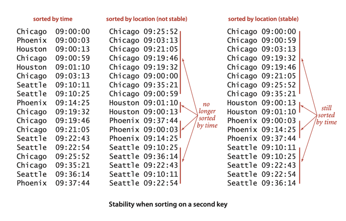
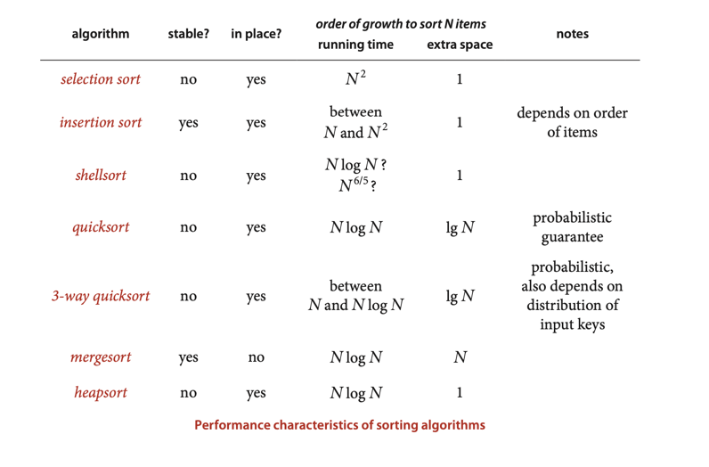
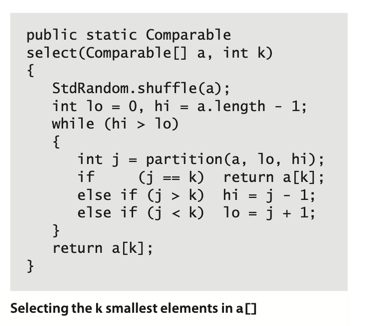

# APPLICATIONS

**Pointer sorting**. The approach we are using is known in the classical
literature as pointer sorting, so called because we process references
to items and do not move the data itself.

**Stability**. A sorting method is stable if it preserves the relative order
of equal keys in the array.  
Some of the sorting methods that we have considered in this chapter are stable
(insertion sort and mergesort); many are not (selection sort, shellsort,
quicksort, and heapsort).

## Which sorting algorithm should I use?

***
**Property T**. Quicksort is the **fastest** general-purpose sort.

**Evidence**: This hypothesis is supported by countless implementations of
quick-sort on countless computer systems since its invention decades ago.
Generally, the reason that quicksort is fastest is that it has only a few
instructions in its inner loop (and it does well with cache memories because
it most often references data sequentially) so that its running time is
~c N lg N with the value of c smaller than the corresponding constants
for other linearithmic sorts.  
With 3-way partitioning, quicksort becomes linear for certain key distributions
likely to arise in practice, where other sorts are linearithmic.
___

## Java system sort.

Java’s systems programmers have chosen to use quicksort (with 3-way partitioning)
to implement the primitive-type methods, and mergesort for reference-type methods.
The primary practical implications of these choices are, as just discussed,
to trade speed and memory usage (for primitive types) for stability (for
reference types).

P.S. Starting from java 1.8 default sorting algorithm for reference-type - is
**TimSort**.

## Reductions

The **Kendall tau distance** between two rankings is the number of pairs that are
in different order in the two rankings. For example, the Kendall tau distance
between:   
0 3 1 6 2 5 4  
1 0 3 6 4 2 5   
is four because the pairs:  
0-1, 3-1, 2-4, 5-4   
are in different relative order in the two rankings, but all other pairs are
in the same relative order.

___
__Proposition U__. Partitioning-based selection is a linear-time algorithm,
on average.

__Proof__: An analysis similar to, but significantly more complex than,
the proof of Proposition K for quicksort leads to the result that the average
number of compares is ~ 2N + 2k ln(N/k) + 2(N - k) ln(N/(N - k)), which is
linear for any allowed value of k.   
For example, this formula says that finding the median (k = N/2) requires
~ (2 + 2 ln 2)N compares, on the average.
Note that the worst case is quadratic but randomization protects against
that possibility, as with quicksort.
***

# Exercise:

## Done:

2.5.2 Write a program that reads a list of words from standard input and prints all
two-word compound words in the list. For example, if after , thought , and afterthought
are in the list, then afterthought is a compound word.  
[Implementation: CompoundWords.java](./exercises/CompoundWords.java)

2.5.6 Implement a recursive version of select()  
[Implementation: KSmallest.java](./exercises/KSmallest.java)
