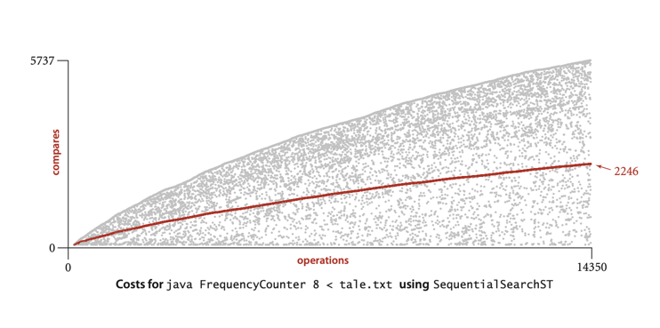
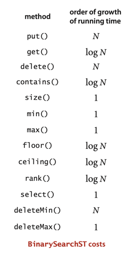
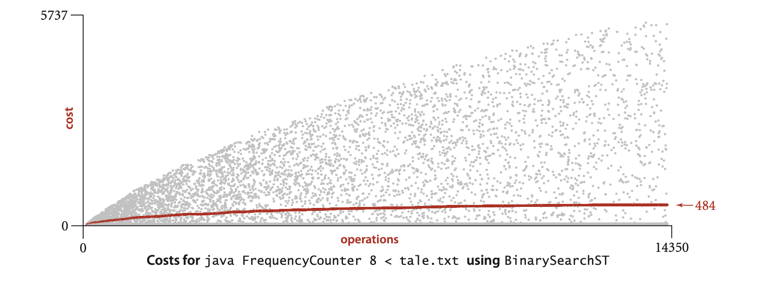
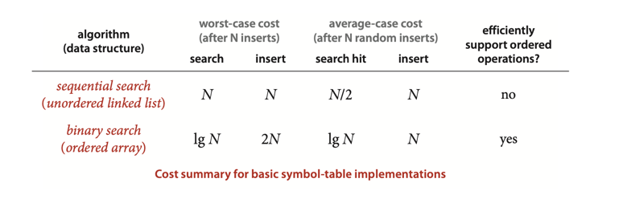

# SYMBOL TABLES

___
**Definition**. A symbol table is a data structure for key-value pairs
that supports two operations: insert (put) a new pair into the table and
search for (get) the value associated with a given key.
***

**Searching cost model.**  
When studying symbol-table implementations, we count compares (equality
tests or key comparisons). In (rare) cases where compares are not in the
inner loop, we count array accesses.

### Sequential search in an unordered linked list

**Proposition A**. Search misses and insertions in an (unordered) linked-list
symbol table having N key-value pairs both require N compares, and search
hits N compares in the worst case.   
In particular, inserting N distinct keys into an initially empty linked-list
symbol table uses ~N^2/2 compares.

**Proof**: When searching for a key that is not in the list, we test every
key in the table against the search key. Because of our policy of disallowing
duplicate keys, we need to do such a search before each insertion.

**Corollary**. Inserting N distinct keys in to an initially empty linked-list
symbol table uses ~N^2/2 compares.

### Binary search in an ordered array

We keep sorted arrays: 1 - for keys, 2 - for values. And use binary search for
put and get operations.

***
**Proposition B**. Binary search in an ordered array with N keys uses no more
than lg N + 1 compares for a search (successful or unsuccessful).
___
**Proposition B (continued)**. Inserting a new key into an ordered array of
size N uses ~ 2N array accesses in the worst case, so inserting N keys into
an initially empty table uses ~ N 2 array accesses in the worst case.

**Proof**: Same as for Proposition A.
***

### Preview

# Exercise:

## Done:

3.1.2 Develop a symbol-table implementation ArrayST that uses an (unordered) array as the
underlying data structure to implement our basic symbol-table API.  
[Implementation: ArrayST.java](./exercises/ArrayST.java)

3.1.3 Develop a symbol-table implementation OrderedSequentialSearchST that uses an ordered linked
list as the underlying data structure to implement our ordered symbol-table API.  
[Implementation: OrderedSequentialSearchST.java](./exercises/OrderedSequentialSearchST.java)

3.1.5 Implement size(), delete(), and keys() for SequentialSearchST.    
[Implementation: SequentialSearchST.java](./SequentialSearchST.java)

3.1.16 Implement the delete() method for BinarySearchST.  
3.1.17 Implement the floor() method for BinarySearchST.  
[Implementation: BinarySearchST.java](./BinarySearchST.java)

3.1.12 Modify BinarySearchST to maintain one array of Item objects that contain
keys and values, rather than two parallel arrays. Add a constructor that takes an array of
Item values as argument and uses mergesort to sort the array.  
[Implementation: ItemBinarySearchST.java](./exercises/ItemBinarySearchST.java)

3.1.22 Self-organizing search. A self-organizing search algorithm is one that rearranges
items to make those that are accessed frequently likely to be found early in the search.
Modify your search implementation for Exercise 3.1.2 to perform the following action
on every search hit: move the key-value pair found to the beginning of the list, moving
all pairs between the beginning of the list and the vacated position to the right one
position. This procedure is called the move-to-front heuristic.  
[Implementation: ArrayST.java](./creative/ArrayST.java)

3.1.28 Ordered insertions. Modify BinarySearchST so that inserting a key that is larger
than all keys in the table takes constant time (so that building a table by calling put()
for keys that are in order takes linear time).  
[Implementation: BinarySearchST.java](./BinarySearchST.java)

3.1.33 Driver for self-organizing search. Write a driver program for self-organizing
search implementations (see Exercise 3.1.22) that uses get() to fill a symbol table
with N keys, then does 10 N successful searches according to a predefined probability
distribution. Use this driver to compare the running time of your implementation from
Exercise 3.1.22 with BinarySearchST for N = 10 3 , 10 4 , 10 5 , and 10 6 using the
probability distribution where search hits the i th smallest key with probability 1/2^i .  
[Implementation: DriverForSelfOrganizingSearch.java](./experiments/DriverForSelfOrganizingSearch.java)

3.1.35 Performance validation I. Run doubling tests that use the first N words of Tale of
Two Cities for various values of N to test the hypothesis that the running time of FrequencyCounter
is quadratic when it uses SequentialSearchST for its symbol table.  
[Implementation: PerformanceValidation.java](./experiments/PerformanceValidation.java)

## Not covered/ TODO (numbers)

- 3.1.24 Interpolation search.
- 3.1.25 Software caching.
- 3.1.26 Frequency count from a dictionary.
- 3.1.27 Small tables.
- 3.1.30 Certification.
- 3.1.31 Performance driver.
- 3.1.32 Exercise driver.
- 3.1.37-41

