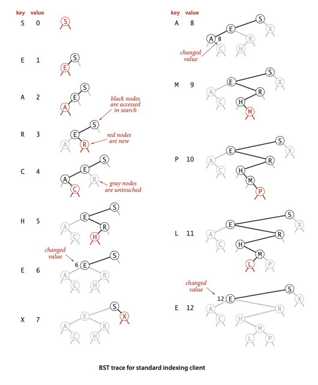
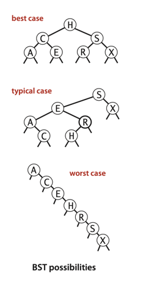
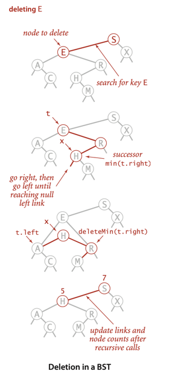
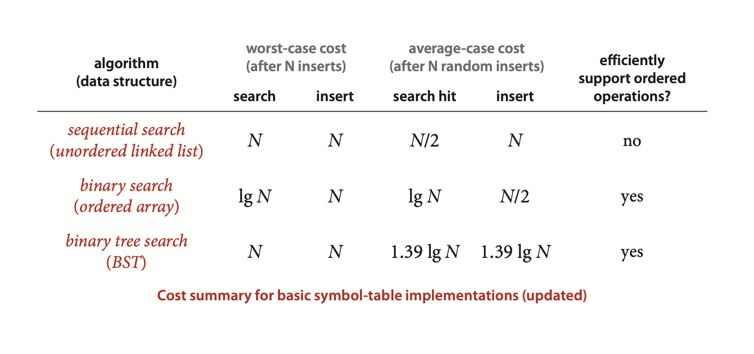

# BINARY SEARCH TREES

**Definition**. A binary search tree (BST) is a binary tree where
each node has a Comparable key (and an associated value) and
satisfies the restriction that the key in any node is larger than
the keys in all nodes in that node’s left subtree and smaller
than the keys in all nodes in that node’s right subtree.

## Analysis

**Proposition C**. Search hits in a BST built from N random keys
require ~ 2 ln N (about 1.39 lg N) compares, on the average.

**Proposition D**. Insertions and search misses in a BST built from N
random keys require ~ 2 ln N (about 1.39 lg N) compares,
on the average.

___
**Proposition E**. In a BST,all operations take time proportional to
the height of the tree, in the worst case.

**Proof**: All of these methods go down one or two paths in the tree.
The length of any path is no more than the height, by definition.
***

# Exercise:

## Done:

3.2.6 Add to BST a method height() that computes the height of the
tree. Develop two implementations: a recursive method (which takes
linear time and space proportional to the height), and a method
like size() that adds a field to each node in the tree (and takes
linear space and constant time per query).  
[Implementation: BST.java](./BST.java)

3.2.7 Add to BST a recursive method avgCompares() that computes the average number of
compares required by a random search hit in a given BST (the internal path length of the
tree divided by its size, plus one). Develop two implementations: a recursive method
(which takes linear time and space proportional to the height), and a method like size()
that adds a field to each node in the tree (and takes linear space and constant time per query).  
[Implementation: BST.java](./BST.java)

3.2.10 Write a test client TestBST.java for use in testing the implementations of
min() , max() , floor() , ceiling() , select() , rank() , delete() , deleteMin() ,
deleteMax() , and keys() that are given in the text. Start with the standard indexing
client given on page 370. Add code to take additional command-line arguments, as appropriate.  
[Implementation: TestBST.java](./exercises/TestBST.java)

3.2.13 Give nonrecursive implementations of get() and put() for BST.  
[Implementation: BSTNonRecursive.java](./BSTNonRecursive.java)

3.2.14 Give nonrecursive implementations of min(), max(), floor(), ceiling(), rank(), and select().
[Implementation: BSTNonRecursive.java](./BSTNonRecursive.java)

## Not covered/ TODO (numbers)

- 3.2.8
- 3.2.12
