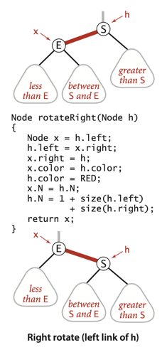

# BALANCED SEARCH TREES

## 2-3 search trees

***
**Definition**. A 2-3 search tree is a tree that is either empty or

- A 2-node, with one key (and associated value) and two links,
  a left link to a 2-3 search tree with smaller keys, and a right
  link to a 2-3 search tree with larger keys
- A 3-node, with two keys (and associated values) and three
  links, a left link to a 2-3 search tree with smaller keys, a middle
  link to a 2-3 search tree with keys between the node’s keys, and a
  right link to a 2-3 search tree with larger keys.

As usual, we refer to a link to an empty tree as a null link.
___

### Insert into a 2-node.

### Insert into a tree consisting of a single 3-node.

### Insert into a 3-node whose parent is a 2-node.

### Insert into a 3-node whose parent is a 3-node.

### Splitting the root.

### Splitting summary.

___
Unlike standard BSTs, which grow down from the top, 2-3 trees grow up
from the bottom.

___
**Proposition F**. Search and insert operations in a 2-3 tree with N
keys are guaranteed to visit at most lg N nodes.

**Proof**: The height of an N-node 2-3 tree is between ⎣log3 N⎦ =  
⎣(lg N)/(lg 3)⎦ (if the tree is all 3-nodes) and ⎣lg N⎦
(if the tree is all 2-nodes)
***

_Unfortunately, the overhead of such an implementation is high
(implementation is complicated), and it might be slower the standard BST._

## Red-Black BSTs

### Encoding 3-nodes.

- Red links lean left.
- No node has two red links connected to it.
- The tree has perfect black balance : every path from the root to a null link has the
  same number of black links.

We can use rotations to help maintain the 1-1 correspondence between 2-3 trees and red-black
BSTs as new keys are inserted.

_Keeping the root black._

## 3 Main Rules:

- If the right child is red and the left child is black, **rotate left**.
- If both the left child and its left child are red, **rotate right**.
- If both children are red, **flip colors**.

## Deletion

## Properties of red-black BSTs

**All symbol-table operations in red-black BSTs are guaranteed to be logarithmic in the size
of the tree (except for range search, which additionally costs time proportional to the number
of keys returned).**

***
**Proposition G**. The height of a red-black BST with N nodes is no more than 2lgN.

**Proof sketch**: The worst case is a 2-3 tree that is all 2-nodes except that the
leftmost path is made up of 3-nodes. The path taking left links from the root is
twice as long as the paths of length ~ lg N that involve just 2-nodes. It is possible,
but not easy, to develop key sequences that cause the construction of red-black BSTs
whose average path length is the worst-case 2 lg N.
___

**Property H**. The average length of a path from the root to a node in a red-black
BST with N nodes is ~1.00 lg N.

___
**Proposition I**. In a red-black BST, the following operations take logarithmic time
in the worst case: search, insertion, finding the minimum, finding the maximum, floor,
ceiling, rank, select, delete the minimum, delete the maximum, delete, and range count.

# Exercise:

## Done:

3.3.21 Create a test client TestRB.java, based on your solution to Exercise 3.2.10.  
[Implementation: TestRedBlackBST.java](./exercises/TestRedBlackBST.java)

3.3.33 Certification. Add to RedBlackBST a method is23() to check that no node is
connected to two red links and that there are no right-leaing red links and a method
isBalanced() to check that all paths from the root to a null link have the same number
of black links. Combine these methods with code from isBST() in Exercise 3.2.32 to
create a method isRedBlackBST() that checks that the tree is a red-black BST.  
[Implementation: RedBlackBSTOrigin.java](./RedBlackBSTOrigin.java)

3.3.39 Delete the minimum. Implement the deleteMin() operation for red-black BSTs by
maintaining the correspondence with the transformations given in the text for moving
down the left spine of the tree while maintaining the invariant that the current node
is not a 2-node.  
[Implementation: RedBlackBSTOrigin.java](./RedBlackBSTOrigin.java)

3.3.40 Delete the maximum. Implement the deleteMax() operation for red-black BSTs.
Note that the transformations involved differ slightly from those in the previous
exercise because red links are left-leaning.  
[Implementation: RedBlackBSTOrigin.java](./RedBlackBSTOrigin.java)

3.3.41 Delete. Implement the delete() operation for red-black BSTs, combining the
methods of the previous two exercises with the delete() operation for BSTs.  
[Implementation: RedBlackBSTOrigin.java](./RedBlackBSTOrigin.java)

## Not covered/ TODO (numbers)

- 3.3.23 - 27
