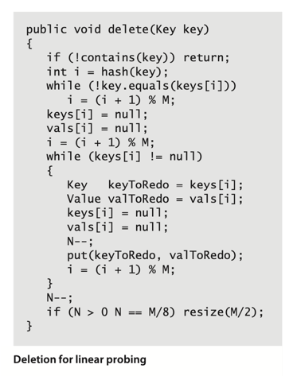
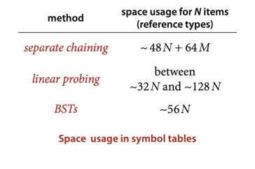

# HASH TABLES

## Hash functions

_The most commonly used method for hashing integers is called **modular hashing**:
we choose the array size M to be prime and, for any positive integer key k,
compute the remainder when dividing k by M._

Converting a hashCode() to an array index.

```
private int hash(Key x){  
    return (x.hashCode() & 0x7fffffff) % M;
}
```

This code masks off the sign bit (to turn the 32-bit number into a 31-bit
nonnegative integer) and then computes the remainder when dividing by M,
as in modular hashing.

In summary, we have **three primary requirements** in implementing a good hash
function for a given data type:

- It should be consistent—equal keys must produce the same hash value.
- It should be efficient to compute.
- It should uniformly distribute the keys.

___
**Assumption J** (uniform hashing assumption). The hash functions that we use
uniformly and independently distribute keys among the integer values between
0 and M–1.

**Proposition K**. In a separate-chaining hash table with M lists and N keys,
the probability (under Assumption J) that the number of keys in a list is within
a small constant factor of N/M is extremely close to 1.

**Property L**. In a separate-chaining hashtable with M lists and N keys,the
number of compares (equality tests) for search miss and insert is ~ N/M.
***

## Hashing with linear probing

Another approach to implementing hashing is to store N key-value pairs in a
hash table of size M > N, relying on empty entries in the table to help with
collision resolution. Such methods are called __open-addressing__ hashing methods.
The simplest open-addressing method is called **linear probing**.



**Proposition M**. In a linear-probing hash table with M lists and `N = a * M`
the average number of probes (under Assumption J) required is:    
`~ 1/2 (1 + 1/(1 - a))` and `~ 1/2 (1 + 1/(1 - a)^2)`    
for search hits and search misses (or inserts), respectively. In particular, when `a`
is about 1/2, the average number of probes for a search hit is about **3/2** and for a
search miss is about **5/2**. These estimates lose a bit of precision as `a` approaches 1,
but we do not need them for that case, because we will only use linear probing for
less than one-half.

## Memory



# Exercise:

## Done:

3.4.9 Implement an eager delete() method for SeparateChainingHashST.    
[Implementation: SeparateChainingHashST.java](./SeparateChainingHashST.java)

3.4.19 Implement keys() for SeparateChainingHashST and LinearProbingHashST.  
[Implementation: SeparateChainingHashST.java](./SeparateChainingHashST.java)  
[Implementation: LinearProbingHashST.java](./LinearProbingHashST.java)
