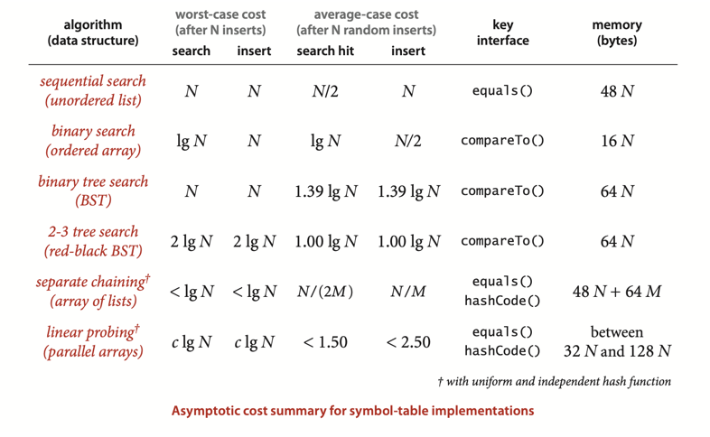

# APPLICATIONS

## Which symbol-table implementation should I use?

_Java’s java.util.TreeMap and java.util.HashMap libraries are symbol-table
implementations based on red-black BSTs and hashing with separate chaining respectively._
