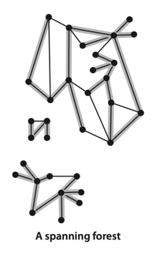

# UNDIRECTED GRAPHS

___
**Definition**. A graph is a set of vertices and a collection of edges
that each connect a pair of vertices.
***

Anomalies. Our definition allows two simple anomalies:

- A self-loop is an edge that connects a vertex to itself.
- Two edges that connect the same pair of vertices are parallel.


**Definition**. A path in a graph is a sequence of vertices connected by edges.
A simple path is one with no repeated vertices. A cycle is a path with at least
one edge whose first and last vertices are the same. A simple cycle is a cycle
with no repeated edges or vertices (except the requisite repetition of the first
and last vertices). The length of a path or a cycle is its number of edges.


**Definition**. A graph is connected if there is a path from every vertex to
every other vertex in the graph. A graph that is not connected consists of a
set of connected components, which are maximal connected subgraphs.

**Definition**. A _tree_ is an acyclic connected graph. A disjoint set of trees
is called a _forest_. A _spanning tree_ of a connected graph is a subgraph that
contains all of that graph’s vertices and is a single tree. A _spanning forest_
of a graph is the union of spanning trees of its connected components.




The _density_ of a graph is the proportion of possible pairs of vertices that
are connected by edges. A _sparse graph_ has relatively few of the possible edges
present; a dense graph has relatively few of the possible edges missing.
Generally, we think of a graph as being sparse if its number of different edges is
within a small constant factor of V and as being dense otherwise.


A _bipartite graph_ is a graph whose vertices we can divide into two sets such that
all edges connect a vertex in one set with a vertex in the other set.


**Adjacency-lists data structure**. The standard graph representation for graphs that
are not dense is called the adjacency-lists data structure, where we keep track of all
the vertices adjacent to each vertex on a linked list that is associated with that vertex.


## Depth-first search

[Implementation: DepthFirstSearch.java](./DepthFirstSearch.java)

- Mark it as having been visited.
- Visit (recursively) all the vertices that are adjacent to it and that have not yet been marked.

```java
public class DepthFirstSearch {
    private boolean[] marked;
    private int count;

    public DepthFirstSearch(Graph G, int s) {
        marked = new boolean[G.V()];
        dfs(G, s);
    }

    private void dfs(Graph G, int v) {
        marked[v] = true;
        count++;
        for (int w : G.adj(v))
            if (!marked[w]) dfs(G, w);
    }

    public boolean marked(int w) {
        return marked[w];
    }

    public int count() {
        return count;
    }
}
```

**Proposition A**. DFS marks all the vertices connected to a given source in time proportional
to the sum of their degrees.

**Proposition A** (continued). DFS allows us to provide clients with a path from a given source
to any marked vertex in time proportional its length.

## Breadth-first search

[Implementation: BreadthFirstPaths.java](./BreadthFirstPaths.java)

**Proposition B**. For any vertex v reachable from s, BFS computes a shortest path from s to v
(no path from s to v has fewer edges).


**Proposition B** (continued). BFS takes time proportional to V + E in the worst case.

## Connected components

[Implementation: CC.java](./CC.java)

**Proposition C**. DFS uses preprocessing time and space proportional to V + E to support constant-time
connectivity queries in a graph.
