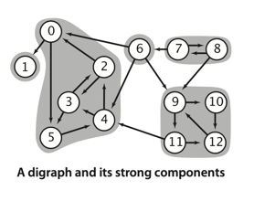

# DIRECTED GRAPHS

**Definition**. A directed graph (or digraph) is a set of vertices and a
collection of directed edges. Each directed edge connects an ordered pair
of vertices.

The first vertex in a directed edge is called its _head_ ;
the second vertex is called its _tail_.

**Definition**. A directed path in a digraph is a sequence of vertices in
which there is a (directed) edge pointing from each vertex in the sequence
to its successor in the sequence. A directed cycle is a directed path with
at least one edge whose first and last vertices are the same.
A simple cycle is a cycle with no repeated edges or vertices (except the
requisite repetition of the first and last vertices). The length of a path
or a cycle is its number of edges.


[Implementation: Digraph.java](./Digraph.java)

**Reversing a digraph**. Digraph also adds to the API a method reverse()
which returns a copy of the digraph, with all edges reversed. This method
is sometimes needed in digraph processing because it allows clients _to find
the edges that point to each vertex_, while adj() gives just vertices connected
by edges that point from each vertex.


## Reachability in digraphs

```
private void dfs(Digraph G, int v) {
    marked[v] = true;
    for (int w : G.adj(v))
        if (!marked[w]) dfs(G, w);
}
```

**Proposition D**. DFS marks all the vertices in a digraph reachable from a
given set of sources in time proportional to the sum of the outdegrees of the
vertices marked.


## Cycles and DAGs

In principle, a digraph might have a huge number of cycles; in practice,
we typically focus on a small number of them, or simply are interested in
knowing that none are present.

#### Cycles in digraphs.

**Directed cycle detection**. Does a given digraph have a directed cycle? If so,
find the vertices on some such cycle, in order from some vertex back to itself.

**Definition**. A directed acyclic graph (DAG) is a digraph with no directed cycles.


#### Depth-first orders and topological sort.

**Proposition E**. A digraph has a topological order if and only if it is a DAG.

**Proposition F**. Reverse postorder in a DAG is a topological sort.

**Proposition G**. With DFS, we can topologically sort a DAG in time proportional
to V + E.

## Strong connectivity in digraphs

**Definition**. Two vertices v and w are strongly connected if they are mutually
reachable: that is, if there is a directed path from v to w and a directed path from
w to v. A digraph is strongly connected if all its vertices are strongly connected to
one another.


A general directed cycle is a directed cycle that may have repeated vertices, it is
easy to see that two vertices are _strongly connected_ if and only if there exists a
general directed cycle that contains them both.



A digraph with V vertices has between 1 and V strong components.
A strongly connected digraph has 1 strong component and a DAG has V strong components.

**Proposition H**. In a DFS of a digraph G where marked vertices are considered in
_reverse postorder_ given by a DFS of the digraph’s reverse G(R) (Kosaraju’s algorithm),
the vertices reached in each call of the recursive method from the constructor are in a
strong component.

[Implementation: KosarajuSCC.java](./KosarajuSCC.java)

**REVERSE POST-ORDER - is a TOPOLOGICAL SORT**

***
**Proposition I**. Kosaraju’s algorithm uses preprocessing time and space proportional
to V + E to support constant-time strong connectivity queries in a digraph.

**Proof**: The algorithm computes the reverse of the digraph and does two depth-first
searches. Each of these three steps takes time proportional to V + E. The reverse copy
of the digraph uses space proportional to V + E.
___

## Reachability revisited

**All-pairs reachability**. Given a digraph, support queries of the form Is there a
directed path from a given vertex v to another given vertex w?

**Definition**. The transitive closure of a digraph G is another digraph with the same
set of vertices, but with an edge from v to w in the transitive closure if and only
if w is reachable from v in G.


Since transitive closures are typically dense, we normally represent them with a matrix
of boolean values, where the entry in row v and column w is true if and only if w is
reachable from v.

```java
public class TransitiveClosure {
    private DirectedDFS[] all;

    TransitiveClosure(Digraph G) {
        all = new DirectedDFS[G.V()];
        for (int v = 0; v < G.V(); v++)
            all[v] = new DirectedDFS(G, v);
    }

    boolean reachable(int v, int w) {
        return all[v].marked(w);
    }
}
```

_The constructor uses space proportional to V^2 and time proportional to V * (V + E)_

Can we support **constant-time queries** with substantially **less preprocessing time
and substantially less space**?  
A general solution that achieves constant-time queries with substantially less than
quadratic space is an **unsolved** research problem.

# Exercise:

## Done:

4.2.1 What is the maximum number of edges in a digraph with V vertices and no parallel
edges? What is the minimum number of edges in a digraph with V vertices, none of
which are isolated?  
_a) (V - 1) * V / 2_  
_b) V - 1_

4.2.24 Hamiltonian path in DAGs. Given a DAG, design a linear-time algorithm to determine whether
there is a directed path that visits each vertex exactly once.  
[Implementation: HamiltonianPath.java](./exercises/HamiltonianPath.java)

## Not covered/ TODO (numbers)

- 